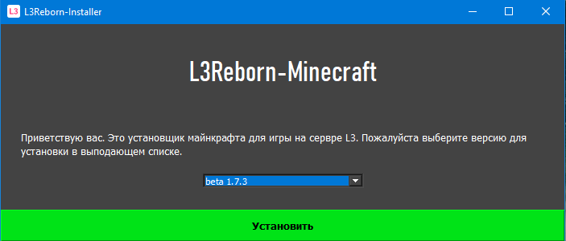
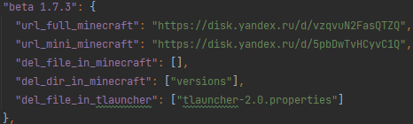

# **MinePy Launcher**

**MinePy** - это кастомный лаунчер для майнкрафта написанный с использованием фреймворка **PyQt5**

> ⚠ **Примечание:** **Находиться в разработке**, в будущем планируеться сделать полноценный лаунчер без применения стороних лаунчеров. А так же более удобную кастомизацию.

## Как это работает?

MinePy использует JSON файл для показа доступных версий для скачивания и так же в этом файле располагаются ссылки на скачивание архивов с файлами.
Более подробно JSON можно посмотреть в репозитории

Как вы могли заметить есть поля "del_file_in_tlauncher" и "del_file_in_minecraft", с майнкрафтом всё понятно, причём тут "TLauncher"?
Пока что данный лайнчер использует сторонний лаунчер для запуска самого майнкрафта, иначе пока ни как.

## Как собрать проект?

Заходим через консоль в папку с проектом и вписываем:

**pyinstaller --windowed --onefile --name <your-name> --clean --icon <yor_icon.ico> installer_v2.py**

## Планы на будущее (TODO)
- Сделать сборку проекта одним скриптом
- Избавиться от использования стороннего лаунчера
- Более тонкая кастомизация по свои нужды
- Избавиться от лишних строк в JSON